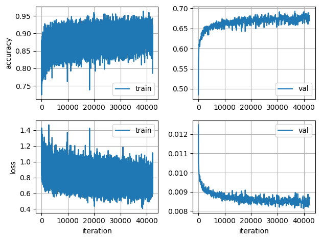
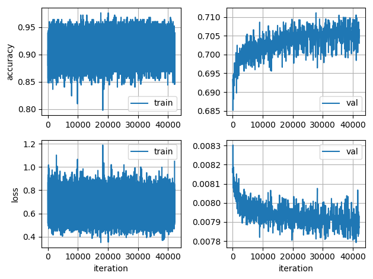
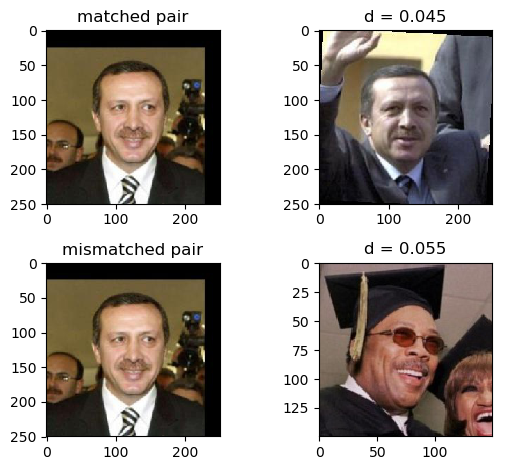

## PyTorch ResNet on UMD-Face

Demo to train a ResNet-50 model on the [UMDFaces](http://www.umdfaces.io/) dataset.

### Setup

* Install [Anaconda](https://conda.io/docs/user-guide/install/linux.html) if not already installed in the system.
* Create an Anaconda environment: `conda create -n resnet-face python=2.7` and activate it: `source activate resnet-face`.
* Install PyTorch and TorchVision inside the Anaconda environment. First add a channel to conda: `conda config --add channels soumith`. Then install: `conda install pytorch torchvision cuda80 -c soumith`.
* Install the dependencies using conda: `conda install scipy Pillow tqdm scikit-learn scikit-image numpy matplotlib ipython pyyaml`.
* *Notes*:
    * Multiple GPUs (we used 5 1080Ti) recommended for the training to finish in reasonable time.
    * Tested on server running CentOS
    * Requires a basic knowledge of [PyTorch](http://pytorch.org/tutorials/beginner/deep_learning_60min_blitz.html) 
    * Optional - an explanatory [blogpost](https://blog.waya.ai/deep-residual-learning-9610bb62c355) on Deep Residual Networks (ResNets).

### Dataset preparation

* Download the [UMDFaces](http://www.umdfaces.io/) dataset (the 3 batches of _still_ images), which contains 367,888 face annotations for 8,277 subjects, split into 3 batches.
* The images need to be cropped into 'train' and 'val' folders. Since the UMDFaces dataset does not specify training and validation sets, by default we select two images from every subject for validation. 
* The cropping code is in the Python script [umd-face/run_crop_face.py](./umd-face/run_crop_face.py). It takes the following command-line arguments:
    * --dataset_path (-d)
    * --output_path (-o)
    * --batch (-b) 
* The following shell command does the cropping for each batch in parallel, using default `dataset_path` and `output_path`.
`for i in {0..2}; python umd-face/run_crop_face -b $i &; done`.

:small_red_triangle: **TODO** - takes very long, convert into shell+ImageMagick script.

### Usage

#### Training:  
* Training script is [umd-face/train_resnet_umdface.py](./umd-face/train_resnet_umdface.py)
* Multiple GPUs: 
    * Under section 3 ("Model") of the training script, we specify which GPUs to use in parallel: `model = torch.nn.DataParallel(model, device_ids=[0, 1, 2, 3, 4]).cuda()`. Change these numbers depending on the number of available GPUs. 
    * Use `watch -d nvidia-smi` to constantly monitor the multi-GPU usage from the terminal. 
    * :small_red_triangle: **TODO** - make this into command-line args.
* At the terminal, specify where the cropped face images are saved using an environment variable: `DATASET_PATH=local/path/to/cropped/umd/faces`
* [config.py](./config.py) lists all the training configurations (i.e. model hyper-parameters) in a numbered Python dict.
    * The training of ResNet-50 was done in 3 stages (*configs 4, 5 and 6*), each of *30 epochs*. After the first stage, we started from the saved model of the previous stage (using the `--model_path` or `-m` command-line argument) and divided the learning rate by a factor of 10.
    * Stage 1 (config-4): train on  the *full UMDFaces dataset for 30 epochs* (42180 iterations with batchsize 250) with a learning rate of 0.001, starting from an ImageNet pre-trained model. These settings are defined in *config-4* of [config.py](./config.py), which is selected using the `-c 4` flag in the command. Example to train a ResNet-50 on UMDFaces dataset using config-4: run `python umd-face/train_resnet_umdface.py -c 4 -d $DATASET_PATH`.
    * Stage 2 (config-5): use the best model checkpointed from config-4 to initialize the network and train it using config-5 `python umd-face/train_resnet_umdface.py -c 5 -m ./umd-face/logs/MODEL-resnet_umdfaces_CFG-004_TIMESTAMP/model_best.pth.tar -d $DATASET_PATH` and so on for the subsequent stages.
* *Training logs:* Each time the training script is run, a new output folder with a timestamp is created by default under `./umd-face/logs` , i.e.  `./umd-face/logs/MODEL-CFG-TIMESTAMP/`. Under an experiment's log folder the settings for each experiment can be viewed in `config.yaml`; metrics such as the training and validation losses are updated in `log.csv`. 
Most of the usual settings (data augmentations, learning rates, number of epochs to train, etc.) can be customized by editing `config.py` and `umd-face/train_resnet_umdface.py`.
* *Plotting CSV logs:* The log-file plotting utility function can be called from the command line as shown in the snippet below. The figure is saved under the log folder in the output location of that experiment.
    * `LOG_FILE=umd-face/logs/MODEL-resnet_umdfaces_CFG-004_TIMESTAMP/log.csv`
    * `python -c "from utils import plot_log_csv; plot_log_csv('$LOG_FILE')"`

stage 1 |   stage 2  | stage 3  
:------:|:----------:|:--------:
|   |  

#### Evaluation: 

*Verification demo:* First, we have a short script, [run_resnet_demo.py](./run_resnet_demo.py) to demonstrate the usage of the model on a toy face verification example. The visualized output of the demo is saved in the the root directory of the project. The 3 sample images are taken from the [LFW](http://vis-www.cs.umass.edu/lfw/) dataset.

---

## PyTorch ResNet on VGGFace2

:construction: **Under construction** :construction:

Training a ResNet model in PyTorch on the [VGGFace2](https://www.robots.ox.ac.uk/~vgg/data/vgg_face2/) dataset (not a demo).

### Dataset preparation

* Register on the [VGGFace2](https://www.robots.ox.ac.uk/~vgg/data/vgg_face2/) website and download their dataset
* VGG provides loosely-cropped images. We use crops from a face detector, saved as a CSV in `[filename, subject_id, xmin, ymin, width, height]` format (not yet made available).  
* The `vgg-face-2/crop_face.sh` script is used to crop the face images into a separate output folder. Please look at the settings section in the script to assign correct paths depending on where the VGGFace2 data was downloaded on your local machine.

:red_circle: TODO - eval on LFW :construction:

